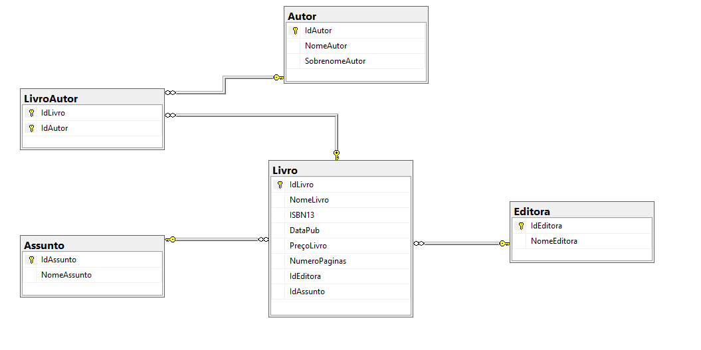

# Library Database SQL Project

This project demonstrates a relational SQL database for library management.

## Features
- Database creation (schema.sql)
- Table creation with *primary and foreign keys* (tables.sql)
- Data insertion (insert_data.sql)
- Queries and *JOIN operations* (queries.sql)
- *Complex queries* demonstrating table relationships, aggregation, and analysis

## Technologies
- SQL Server / SQL Management Studio
- Relational Database Design
- SQL Querying and Data Management

## Database Diagram

## How to run
1. Run schema.sql to create the database
2. Run tables.sql to create tables with relationships
3. Run insert_data.sql to add sample data
4. Run queries.sql to test queries and complex JOIN operations

## Skills Demonstrated
- Database modeling and normalization
- Primary and foreign key relationships
- Data insertion and management
- Complex SQL queries including JOINs, GROUP BY, and aggregation
- Understanding relational database structure
